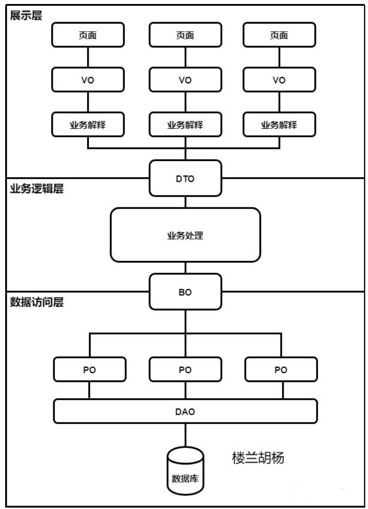
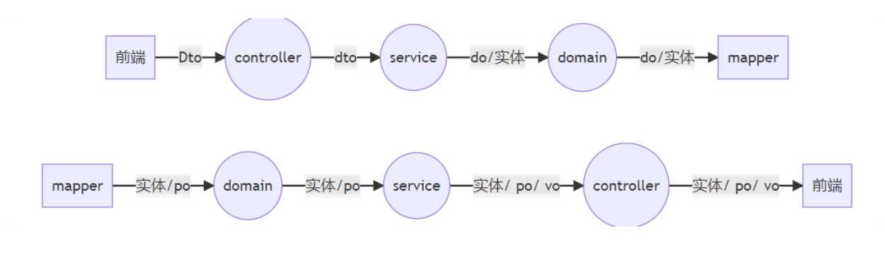

# 1.各种model

```text
POJO

总的来说，普通Java对象POJO（Pure Old Java Object 、 Plain Ordinary Java Object），按照Martin Fowler的解释是“Plain Old Java Object”，从字面上翻译为“纯洁老式的java对象”，但大家都使用“简单java对象”来称呼它。包含DO、DTO、BO、VO和PO等，它们本质上都是一个简单的java对象，实际就是普通的JavaBeans。没有业务逻辑，有时可以作为VO或DTO来使用。当然，这里特意说明纯普通Java对象，如果你有一个简单的运算属性也是可以的，但不允许有业务方法。

POJO是指这样的java对象：

    有一些private的参数作为对象的属性
    针对每一个参数定义get和set方法
    没有从任何类继承
    没有实现任何接口
    没有被其它框架侵入。

许多开发者把JavaBean看作遵从特定命名约定的POJO。

POJO其实是比javabean更纯净的简单类或接口。POJO严格地遵守简单对象的概念，而不具有业务逻辑处理的能力，而一些JavaBean中往往会封装一些简单逻辑。例如，改造User后，可以得到一个JavaBean。
VO

VO（View Object）视图模型，用于展示层，它的作用是把某个指定页面（或组件）的所有数据封装起来。如果是一个DTO对应一个VO，则DTO等价于VO;但是如果一个DTO对应多个VO，则展示层需要把VO转换为服务层对应方法所要求的DTO，传送给服务层，从而达到服务层与展示层解耦的效果。

一般用在业务逻辑层（Service）对前端（Web） 的视图模型效果控制的展示上，说白了就是后台向前端传输数据。示例：xxxVO，xxx一般为网页名称。注：在展示业务不复杂的系统，可直接使用DTO。
DTO

数据传输对象DTO（Data Transfer Object）是一个比较特殊的对象，它有两种存在形式：在后端，它的存在形式是java对象，也就是在controller里面定义的请求参数，通常在后端不需要关心怎么从json转成java对象的，这个都是由一些成熟的框架帮你完成啦，比如spring框架；在前端，它的存在形式通常是js里面的对象（也可以简单理解成json），即通过ajax请求的那个数据体。这也是为什么把他画成横跨两层的原因。举个例子，xxxDTO，xxx为业务领域相关的名称。

现在微服务盛行，服务和服务之间调用的传输对象能叫DTO吗？我的理解是看情况，DTO的一个隐含意义是要能够完整的表达一个业务模块的输出。如果服务和服务之间相对独立，那就可以叫DTO；如果服务和服务之间不独立，每个都不是一个完整的业务模块，拆开可能仅仅是因为计算复杂度或者性能的问题，那这就不能够叫做DTO，只能是BO。

DTO与BO或者DO的区别是DTO没有任何行为（方法），只是存储和提供它所拥有数据的查询（访问器和修改器）。DTO是简单对象，不包含任何需要测试的业务逻辑。
Entity/PO

持久化对象PO（Persistent Object）等同于Entity，它们的概念是一致的。数据库表中的记录在java对象中的显示状态。最形象的理解就是一个PO对象对应数据库中的一条记录，一个PO的数据结构对应着库中一张表的表结构，即自身属性与数据表字段一一对应。好处是可以把一条记录作为一个对象处理，方便的转为其它对象。

例如我们有一条数据，现在有一个简单类而且已经是被赋予了这条数据的实例，那么这条数据在这个简单类中的存在状态就是PO，不管这个简单类是DO还是BO抑或其它。PO只是数据持久化的一个状态。

通常PO里面除了get，set之外没有别的方法。对于PO来说，数量是相对固定的，一定不会超过数据库表的数量。
DO

领域对象 DO（Domain Object） 是从现实世界中抽象出来的有形或无形的业务实体，它用来接收数据库对应的实体，是一种抽象化的数据状态，介于数据库与业务逻辑之间。

一般在业务逻辑层（Service）对数据库（SQL） 进行访问时，用于接收数据。xxxDO，xxx即为数据表名。另外，DO与Entity的不同点就是DO是与数据库存在着某种映射关系的Entity，总的来说DO是Entity的一种。

现在主要有两个版本一个是阿里巴巴的开发手册中定义的DO（ Data Object），这个等同于上面的PO；另一个是在DDD（Domain-Driven Design）领域驱动设计中定义的DO（Domain Object），这个等同于上面的BO。
BO

业务对象(Business Object，BO)是对数据进行检索和处理的组件，主要作用是把业务逻辑封装为一个对象，这个对象可以包括一个或多个其它的对象。形象描述为一个对象的形为和动作，当然也有涉及到其它对象的一些形为和动作。

BO通常位于中间层或者业务逻辑层。BO支持序列化和反序列化，可以轻易地将BO的Java实例转换为一个XML文件或者一个流保存起来，并且在需要的时候，将这个BO从XML或者流中转换回一个Java实例。举个简单的例子，一个简历包含教育经历、工作经历、社会关系等三个模块，每个模块对应一个PO；建立一个BO对象处理简历，则每个BO包含这三个PO。

应用中的所有实体(Entity)都是BO，但并不是所有BO都是实体。BO包括包含方法的实体对象(Entity Object)和不包含方法的值对象(VO)。
Model

Model是数学逻辑名词，包括有限操作的集合以及定义于其上的关系，主要用于分析、设计过程。

实体类和模型 Model 在计算机程序设计中有两个概念：一个是三层架构中的实体类，另一个是MVC架构中的模型。在“三层架构”中，为了面向对象编程，将各层传递的数据封装成实体类，便于数据传递和提高可读性。在MVC（模型Model-视图View-控制器Controller）模式中，Model代表模型，是业务流程/状态的处理以及业务规则的制定，接受视图请求的数据，并返回最终的处理结果。业务模型的设计可以说是MVC最主要的核心。
View

在MVC模式中，View代表视图，用来解析Model带来的数据模型，以展示视图数据，View的模型觉决定了需要什么样的Model来对接，相互联系。
DAO

数据访问对象DAO （Data Access Object）是一个数据访问接口，所谓数据访问，顾名思义，就是与数据库打交道，夹在业务逻辑与数据库资源中间。一般在业务逻辑层对数据库进行访问时使用。

xxxDAO，xxx即为实体类名（Entity实体）。在核心J2EE模式中是这样介绍DAO模式的：为了建立一个健壮的J2EE应用，应该将所有对数据源的访问操作抽象封装在一个公共API中。用程序设计的语言来说，就是建立一个接口，接口中定义了此应用程序中将会用到的所有事务方法。在这个应用程序中，当需要和数据源进行交互的时候就使用这个接口，并且编写一个单独的类或者xml文件，来实现这个接口在逻辑上对特定数据的操作。
放置目录

    PO 通常放在名为 bean、entity、model 目录中
    DAO 通常在 DAO、mapper 目录中
    BO 通常在service、manager、business 目录中

POJO的扩展

POJO 仅包含最简单的字段属性，没有多余的东西，它本质上就是一个普通的JavaBean。但是在POJO的基础上，能够扩展出不同的对象。

    为POJO增加了持久化的方法（Insert、Update、Delete……）之后，POJO就变成了PO。
    为POJO增加了数据绑定功能之后，POJO就变成了View Object，即UI Model。
    为POJO增加业务逻辑的方法（比如单据审核、转帐……）之后，POJO就变成了Domain Model。
    POJO还可以当作DTO使用。

```
# 2.调用关系图

