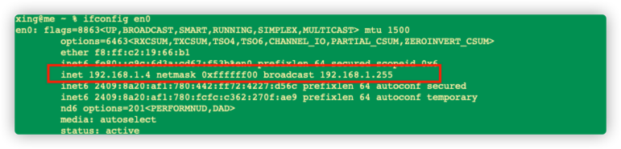

# 笔记

````text
sudo find / -type f -name 'redis.conf'
:w            - 保存文件，不退出 vim
:w file  -将修改另外保存到 file 中，不退出 vim
:w!          -强制保存，不退出 vim
:wq          -保存文件，退出 vim
:wq!        -强制保存文件，退出 vim
:q            -不保存文件，退出 vim
:q!          -不保存文件，强制退出 vim
:e!          -放弃所有修改，从上次保存文件开始再编辑


查找8080端口：
sudo lsof -i :8080

查看服务占用进程
ps -ef | grep java
ps -ef | grep -i redis

查看端口号
netstat -nap | grep 进程号

根据PID杀进程：
sudo kill -9 进程号（对应的pid号）


查看nginx的默认安装目录
whereis nginx

查看服务
rpm -qa | grep -i mysql

卸载服务 
yum remove mysql


````

## mac 查看ip

```shell
ifconfig en0

ifconfig | grep "inet " | grep -v 127.0.0.1

```

