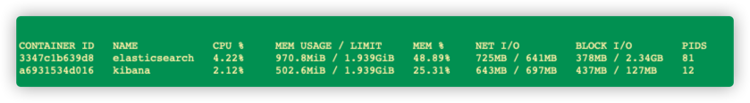

# 原理

## 三要素

```text
镜像文件image,一个镜像可以创建多个容器
容器: 是用镜像创建的运行实例
仓库
```

安装命令如下：

```text
curl -fsSL https://get.docker.com | bash -s docker --mirror Aliyun
```

也可以使用国内 daocloud 一键安装命令：

```text
curl -sSL https://get.daocloud.io/docker | sh
```

## docker服务命令

```tex
启动: systemctl start docker
停止: systemctl stop docker
重启: systemctl restart docker
查看状态: systemctl status docker
开机启动: systemctl enable docker
```

## 镜像命令

```tex
查看概要: docker info
查看本地镜像: docker images
拉取镜像: docker pull
查看存储: docker system df
强制删除镜像: docker rmi -f

查看已下载的Docker镜像latest具体版本
docker image inspect (docker image名称):latest|grep -i version
```

## 容器命令

```text
启动交互式容器(前台命令行)

查看运行的容器: docker ps 
显示所有的容器，包括未运行的: docker ps -a
    停止后无法查看,要查看需要运行的,可以用 docker images 查找容器id 也可以用 docker ps -n 2 最近使用的
查看已经停止的: docker ps -n 2
进入容器: docker exec -it 容器id /bin/bash

退出
容器关闭:   exit 
容器不停止:  ctrl+p+q 

启动已经停止的容器id: docker start 容器id
重启容器: docker restart 容器id
停止容器: docker stop 容器id
强制停止容器: docker kill 容器id
删除已停止容器: docker rm

开机启动 docker update --restart=always  xx
```

## 查看docker服务状态

```shell
docker stats 
```



## 启动守护式容器

```text

启动守护容器: docker run -itd --name ax-mall-redis -p 6379:6379 redis

查看日志: docker logs 容器id

进入已经启动的容器:

    docker exec -it 容器id /bin/bash ,启动新进程,用exit退出,不会停止,常用
    docker attach 容器id ,用exit退出,会停止:   

```

## 复制文件到容器

```text
docker cp 容器di:容器内路径 目的主机路径
```

## 加载原理

```text
镜像层只读
容器层可写
```

## 容器数据卷

```text
--privileged=true

docker run -it --privileged=true-v 宿主机绝对路径目录:/容器内目录 镜像名(不是容器)

查看挂载等信息: docker inspect 

```

### 容器数据卷读写规则

```text
容器卷,读写权限,宿主机权限正常
```

### 容器数据卷继承

```text
docker run -it --privileged=true --volumes-from 父类 --name u2 Ubuntu
```

# 构建docker服务

## DockerFile 制作jar镜像

### 说明

```text
构建镜像的文本

1.每条保留字指令必须为大写字母,且后面要跟随至少一个参数
2.指令按照从上往下,顺序执行
3.#表示注释
4.每条指令都会创建一个新的镜像层,并对镜像进行提交

 dockerfile面向开发,docker镜像成为交付标准,docker容器涉及部署与运维
 
```

### 常用保留字

```text
https://github.com/docker-library/tomcat/blob/7dc6e45523f302d0d90b9b5bfef5f179a226f604/10.1/jdk11/corretto/Dockerfile

FROM: 基础镜像,当前新镜像基于哪个镜像,指定一个已经存在的镜像作为模板

MAINTAINER: 维护者的姓名和邮箱

RUN: 2种格式,shell格式,简单一点,例如安装vim公共: RUN yum -y install vim 
    
EXPOSE: 当前容器对外暴露的端口,P p 区别
    
WORKDIR:    指定在创建容器后,终端默认登录进来的工作目录,一个落脚点

USER: 指定镜像以什么样用户执行,如果不指定,默认root用户,一般不用

ENV:   用来在构建镜像过程中设置环境变量, 使用 $变量名 取值

ADD:    将宿主机目录下的文件拷贝镜像且会自动出来URL和解压tar压缩包

COPY:   和add效果一样  参数cp,add多个解压功能

VOLUME: 容器卷位置 ,参数 -v 

CMD:   
    指定容器 启动后 要干的事情
    注意: 多个cmd 只有一个有效,会被docker run 之后的参数替换
    和RUN 命令区别: 
        cmd在docker run时运行, 
        run 在docker build时运行
    
 
ENTRYPOINT: 
    也是用来指定一个容器启动时候运行的命令
    类似cmd,但 不会被 docker run 后面的命令覆盖
    而且这些参数会被当做参数送给ENTRYPOINT指令指定的程序
    
    变参,才会使用cmd
```

### 构建镜像

```text
Dockerfile 和jar在同一级目录
```

```shell
# 构建镜像  最后 有个点
docker build -t 镜像名字:版本号 .

```

### idea - docker 插件制作镜像

#### pom.xml

```
  <!--使用docker-maven-plugin插件-->
            <plugin>
                <groupId>com.spotify</groupId>
                <artifactId>docker-maven-plugin</artifactId>
                <version>1.2.2</version>
                <!--将插件绑定在某个phase执行-->
                <executions>
                    <execution>
                        <id>build-image</id>
                        <!--用户只需执行mvn package ，就会自动执行mvn docker:build-->
                        <phase>package</phase>
                        <goals>
                            <goal>build</goal>
                        </goals>
                    </execution>
                </executions>
                <configuration>
                    <!--指定生成的镜像名-->
                    <imageName>${project.artifactId}</imageName>
                    <!--指定标签-->
                    <!--指定标签-->
                    <imageTags>
                        <imageTag>${project.artifactId}</imageTag>
                    </imageTags>
                    <!-- 指定 Dockerfile 路径-->
                    <dockerDirectory>docker</dockerDirectory>
                    <!--指定远程 docker api地址,本地就忽略-->
                    <!--                    <dockerHost>http://localhost:2375</dockerHost>-->
                    <!-- 这里是复制 jar 包到 docker 容器指定目录配置 -->
                    <resources>
                        <resource>
                            <targetPath>/</targetPath>
                            <!--jar 包所在的路径 此处配置的 即对应 target 目录-->
                            <directory>${project.build.directory}</directory>
                            <!-- 需要包含的 jar包 ，这里对应的是 Dockerfile中添加的文件名 -->
                            <include>${project.build.finalName}.jar</include>
                        </resource>
                    </resources>
                </configuration>
            </plugin>
```

#### 运行

```
maven 打包后会在target 形成 文件夹
```


```
点击Dockerfile 按钮 构建镜像,需要运行,就要添加参数
```




## docker 网络

### 说明

```text
docker network ls

docker 服务默认会创建一个docker0网桥(其上有一个docker0内部接口),他在内核层链接了其他物理或者虚拟网卡,
就将所有容器和本地主机都放在同一个物理网络,docker默认指定了docker0接口的IP地址和子网掩码,
让主机和容器之间可以通过网桥互相通信

host模式: 容器没有ip和端口,使用宿主机
bridge模式:容器独立的ip和端口
container: 借用别人的ip和端口

alpine linux发行版

自定义网络: 因为docker容器内部的ip有可能变化的
docker link 过时的技术
```

### 相关命令

|              命令名称              | 说明             |
|:------------------------------:|:---------------|
| docker network connect 网络 容器id | 将容器连接到网络       |
|     docker network create      | 创建一个网络         |
|   docker network disconnect    | 断开容器的网络        |
|     docker network inspect     | 显示一个或多个网络的详细信息 |
|       docker network ls        | 列出网络           |
|      docker network prune      | 删除所有未使用的网络     |
|       docker network rm        | 删除一个或多个网络      |

### 显示所有容器IP地址：

```shell
docker inspect --format='{{.Name}} 网络: {{range.NetworkSettings.Networks}}  ip地址: {{.IPAddress}}{{end}}' $(docker ps -aq)
```

### 查看容器IP地址：

```shell
docker inspect 容器ID | grep IPAddress

docker network inspect demo-network
```

### 查看同一个网络的容器

```shell
docker network inspect demo-network
```

## 容器编排

```text
compose 是docker推出的一个工具软件,管理多个容器组成一个应用,需要定义一个YAML格式的配置文件
docker-compose.yml,写好多个容器之间的调用关系,只要一个命令就同时启动和关闭容器 
```

### compose 核心

```text
一个文件
两个要素: 服务,一个个应用容器实例
        工程,右一组关联的应用容器组成的一个完整业务单元,在yml文件中定义
        
三个步骤:
    编写Dockerfile
    使用docker-compose.yml定义一个完整的业务单元
    执行命令,docker-compose up 启动整个应用程序
```

### 在yml路径下执行命令

```shell

#启动并后台运行
docker-compose up

#启动并后台运行
docker-compose up -d

# 进入容器内部实例
docker-compose exec  yml_id

docker-compose ps 
docker-compose top

#查看日志
docker-compose  logs -f
docker-compose  logs yml_id

#检查配置
docker-compose config
#检查配置 有问题才输出
docker-compose config -q

docker-compose restartdocker exec -it
docker-compose start
docker-compose stop
# 

```

### 编排mysql注意事项docker

```text
1.mysql库表 外挂时数据卷,需要提前建库建表,不然无数据库,启动失败
2.用户名,需要 新建一个,不要用root,不然启动失败

```

## CIG 监控

# 安装软件

## redis安装

```text
docker run -itd --name ax-mall-redis -p 6379:6379 redis

配置指定运行
#安装, 先提前建立配置文件redis.conf, 不然自动创建会识别成文件夹
docker run --privileged=true --name ax-mall-redis -p 6379:6379 -v /root/redis/redis.conf:/etc/redis/redis.conf -v /root/redis/data:/data -d redis redis-server /etc/redis/redis.conf

修改密码,直接修改 redis.conf 文件


===============
-p 6379:6379：映射容器服务的 6379 端口到宿主机的 6379 端口。外部可以直接通过宿主机ip:6379 访问到 Redis 的服务。

docker run -itd --name redis-test -p 6379:6379 redis

为现有的redis创建密码或修改密码的方法：

1.进入redis的容器 docker exec -it 容器id /bin/bash

2.运行命令：redis-cli

3.查看现有的redis密码：config get requirepass

4.设置redis密码 config set requirepass ****（****为你要设置的密码）

```

## mysql安装

```text
docker run --name demo-mysql5.7 -e MYSQL_ROOT_PASSWORD=12345678 -p 3306:3306 -d mysql:5.7

docker run --privileged=true --name ax-mall-mysql -p 3306:3306 -v /root/mysql/log:/var/log/mysql -v /root/mysql/data:/etc/lib/mysql -v /root/mysql/conf:/etc/mysql/conf.d -e MYSQL_ROOT_PASSWORD=AXing#631122 -d mysql

 中文乱码,查看字符集
    show variables like 'char%';
    
中文乱码
vim my.cnf

[client]
default-character-set=utf8
[mysql]
default-character-set=utf8
[mysqld]
collation-server=utf8_general_ci
character-set-server=utf8
init-connect='SET NAMES utf8'
```

## nginx

```text
建立挂载目录
mkdir -p app/nginx/{conf,conf.d,html,logs}

docker cp e2489e439a1a:/etc/nginx/nginx.conf /app/nginx/conf/nginx.conf

docker cp e2489e439a1a:/etc/nginx/conf.d/default.conf /app/nginx/conf.d/default.conf


docker run --name ax-mall-nginx -d -p 80:80 -v /app/nginx/html:/usr/share/nginx/html -v /app/nginx/conf/nginx.conf:/etc/nginx/nginx.conf -v /app/nginx/conf.d/default.conf:/etc/nginx/conf.d/default.conf -v /app/nginx/logs:/var/log/nginx nginx

```

# 高级版

## mysql 主从复制,一主一从

```text
主
docker run --privileged=true --name ax-mall-mysql -p 3306:3306 -v /root/mysql/log:/var/log/mysql -v /root/mysql/data:/etc/lib/mysql -v /root/mysql/conf:/etc/mysql/conf.d -e MYSQL_ROOT_PASSWORD=AXing#631122 -d mysql

从
docker run --privileged=true --name ax-mall-mysql-slave -p 3308:3306 -v /root/mysql-slave/log:/var/log/mysql -v /root/mysql-slave/data:/etc/lib/mysql -v /root/mysql-slave/conf:/etc/mysql/conf.d -e MYSQL_ROOT_PASSWORD=AXing#631122 -d mysql


主创建从账户
CREATE USER 'slave'@'%' IDENTIFIED BY 'AXing#631122';

主授权 
GRANT REPLICATION SLAVE,REPLICATION CLIENT ON*.*TO 'slave'@'%'; 

查看主从信息
show master status;

在从mysql 添加

 #MASTER_LOG_FIL MASTER_LOG_POS 两个参数的值与主库保持一致,用 show master status; 查看 主信息 
change master to master_host='47.101.156.93',master_port=3306,master_user='slave',master_password='AXing#631122',master_log_file='binlog.000008',master_log_pos=156,master_connect_retry=30;

# 在从 查看 主 状态
show slave status \G;

Slave_IO_Running: No
Slave_SQL_Running: No 
还未开始

# 在  从 在中开启同步
start slave;

出现,就成功了 
Slave_IO_Running: Yes
Slave_SQL_Running: Yes 

# 绑定错误 先关闭线程 再绑定,再开启线程
STOP SLAVE IO_THREAD;
start SLAVE IO_THREAD; 

```

## 分布式存储 - 哈希取余算法

```text
面试题
1~2亿条数据需要缓存,如何设计这个存储案例

回答: 单机单台不可能,肯定是分布式存储,用redis如何落地?

3主3从redis集群扩容配置:

3种方案
1.哈希取余分区
    2亿条记录就是2亿个kv,单机不行必须分布式多机,假设有3台机器构成一个集群,用户每次读写操作都是根据公式 hash(key)%N个机器台数,计算出哈希值,用来决定数据映射到那个节点上
    
优点:
    简单粗暴,直接有效,只需要预估好数据规划好节点,例如3,8,10台,就能保证一段时间的数据支撑,使用hash算法让固定的一部分请求落到同一台服务器上,
这样每台服务器固定处理一部分请求(并维护这些请求的信息),起到负载均衡+分而治之的作用.

缺点:
    原来规划好的节点,进行扩容或者缩容比较麻烦,每次数据变动导致节点有变动,映射关心需要重新进行计算,在服务器个数固定不变没有问题,再扩容或者宕机情况,取模公式发生变化 hash(key)/N 发生变化,
    会导致hash取余全部数据重新洗牌
   
   小公司使用就够了
    
    
2.一致性哈希算法分区 (分布式缓存数据变动和映射问题,某个机器宕机了,分母数量改变了,自然取余数就不合适了)
    三个步骤
    1.算法构建一致性哈希环
    一致性哈希环比如有个hash函数并按照算法产生hash值,这个算法的所有可能哈希值会构成一个全量集,这个集合可以成为一个hash空间[0,2^32-1],这个是一个线性空间,
    但是在算法中,我们通过适当的逻辑控制将他首尾相连(0=2^32),这样让他的逻辑形成一个环形空间.
    
    2.服务器ip节点映射
    3.key落到服务器的落键规则
    
优点:
    一致性哈希算法的容错性和扩容性
缺点:
    数据倾斜问题
    
3.哈希槽分区
    哈希槽实质就是一个数组,数组[0,2^14-1]形成hash slot空间
    解决均匀分配的问题,
    一个集群只能有16384个槽,


集群存储错误:
    单机登录,set 值会报错, 添加参数登录集群模式 -c
    redis-cli -p 端口 -c 
    
    主宕机变从,修复后还是从
    
    
主从扩容,缩容
   
    重新分配槽位: redis-cli --cluster reshard ip:端口
 
    槽位分配说明: 
        扩容:槽位变更,每个槽位 前段 切除部分,给新增的
        缩容: 先移除从机,主机移除槽位,可以指定全部给某一个
       
```

## 面试题

```text
仓库名,标签都是<none>的镜像,俗称 虚悬镜像, 需要删除
```

##                                                           
