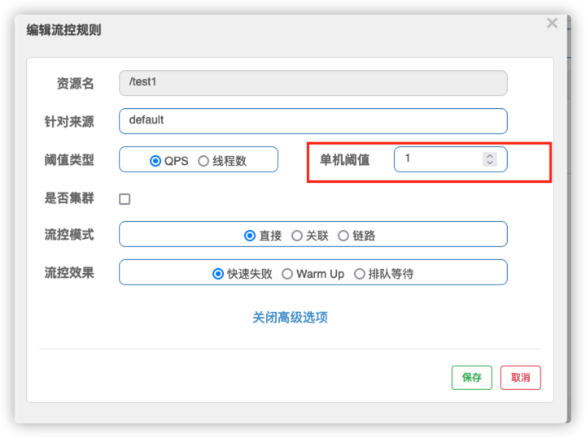
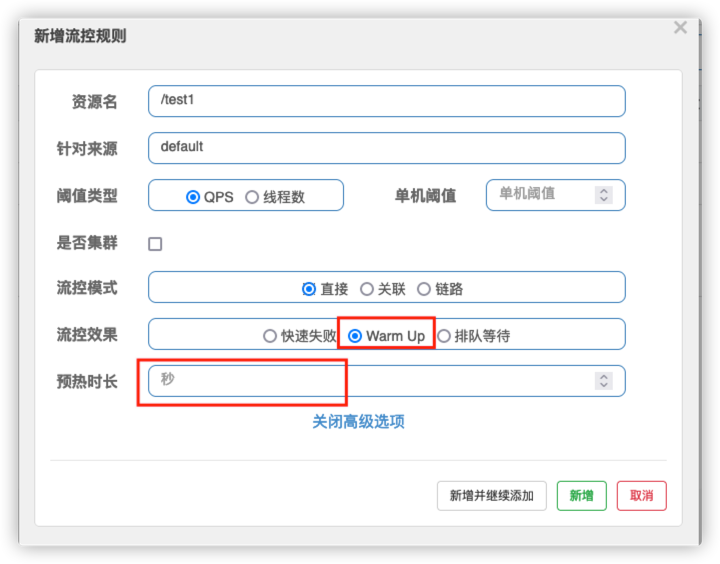

# nacos

```text
nacos 自带负载均衡
同时引入了 ribbon 负载均衡,就可以用RestTemplate, Ribbon是一个基于HTTP和TCP的客户端负载均衡工具

```

```text
-DServer.port=9011
```


### 注册中心对比

| 框架        | CAP模型 | 控制台管理 | 活跃度 |
|-----------|-------|-------|-----|
| Eureka    | AP    | 支持    | 低   |
| Zookeeper | CP    | 不支持   | 中   |
| Consul    | CP    | 支持    | 高   |
| Nacos     | AP+CP | 支持    | 高   |

```text
CAP理论，一个分布式系统不可能同时满足一致性、高可用性和分区容错性
C:一致性
A:高可用性
P:容错性
Nacos支持AP,CP切换
```

### Nacos注解

```text
@EnableNacosConfig 注解启用 Nacos Spring 的配置管理服务。

@NacosValue 注解设置属性值

@EnableNacosDiscovery 注解开启 Nacos Spring 的服务发现功能

@NacosInjected 注入 Nacos 的 NamingService

@NacosPropertySource 加载 dataId 为 example 的配置源，并开启自动更新：

@LoadBalanced 在使用Spring Cloud Ribbon客户端进行负载均衡的时候，可以给RestTemplate（Bean） 加一个@LoadBalanced注解，就能让这个RestTemplate在请求时拥有客户端负载均衡的能力

@EnableDubbo 激活 Dubbo 注解驱动以及外部化配置，其 scanBasePackages 属性扫描指定 Java 包，将所有标注 @Service 的服务接口实现类暴露为 Spring Bean

@PropertySource 是 Spring Framework 3.1 引入的标准导入属性配置资源注解，它将为 Dubbo 提供外部化配置

@Reference 是 Dubbo 远程服务的依赖注入注解，需要服务提供方和消费端约定接口（interface）、版本（version）以及分组（group）信息

@PostConstruct 部分代码则说明当 DemoServiceConsumerBootstrap Bean 初始化时，执行十次 Dubbo 远程方法调用。
@RefreshScope 能刷新配置

@EnableDiscoveryClient为 Spring Cloud 原生注解 开启服务注册发现功能

@EnableNacos是一个模块驱动的注解，它支持 Nacos Spring 的所有功能，包括服务发现和配置管理。它等于 @EnableNacosDiscovery 加上 @EnableNacosConfig，可以单独配置并在不同场景中使用。
（@EnableNacos=@EnableNacosDiscovery+@EnableNacosConfig）

@NacosConfigListener 的类型转换包括内置和自定义实现。 默认情况下，内置类型转换基于 Spring DefaultFormattingConversionService。

@NacosProperties 是全局和自定义 Nacos 属性的统一注解。 它充当Java Properties 和 NacosFactory 类之间的中介。NacosFactory 负责创建 ConfigService 或 NamingService 实例。
@NacosProperties 的属性完全支持占位符，它的源是Spring Environment 抽象中的各种 PropertySource，通常是Java System Properties 和操作系统环境变量。

@NacosInjected 是一个核心注解，用于在Spring Beans 中注入 ConfigService 或 NamingService 实例，并使这些实例可缓存。 这意味着如果它们的 @NacosProperties 相等，则实例将是相同的，无论属性是来自全局还是自定义的 Nacos 属性：


```

### 配置中心

```text
bootstrap.yml优先级高于application.yml

nameSpace 隔离的
DataId(active),group,namespace 三个组合

```


### 集群和持久化配置

```text
3个nacos才能作集群
修改启动脚本,添加端口启动参数
1.conf/cluster.conf 添加 ip
2.bin/startup.sh 添加 p参数

```

# sentinel 熔断

```text
端口: 8080,懒加载,需要请求一次
```

## 流控规则

### 阈值类型

```text
阈值类型
QPS: 每秒请求次数 1秒一次
线程数:
```



### 关联

```text
关联资源

test2 访问过多, test1就限流
```


### 预热



```text
默认因子3,即请求QPS从 阈值/3开始,经多少预热时长才逐渐升到设定的QPS阈值

案例: 阈值10, 预热时长设置5秒
10/3=3 即阈值刚开始为3,5秒后阈值恢复到10
```

### 排队等待


```text
匀速排队,阈值必须设置QPS
```

## 熔断降级


```text
没有半开状态,区别于hystrix

例子
1秒持续进入5个请求,同时平均响应时间>阈值 --> 触发降级 --> 时间窗口期结束 --> 恢复

RT: 
异常比例: 范围 0~1, 请求内部失败比例
异常数:资源1分钟的异常数目超过值
```

## 热点规则


```text
只支持QPS模式

某个查询 key 热点
最好用 blockHandler,提示友好
@SentinelResource(value = "hotKey",blockHandler = "deal_hotKey")
```

```text
参数例外项: 特定参数,特定QPS
```


## 系统规则


```text
整个系统都不能使用,一般不怎么用
```

## @SentinelResource 注解

```text
SentinelResource

```

## 规则持久化

```text
Sentinel配置文件配置在nacos中,nacos读取mysql
```

```text
[
  {
  
    "resource": "/test1",  #资源名称
    "limitApp": "default",#来源应用
    "grade": 1, #阈值
    "count": 5, #单机阈值
    "strategy": 0,  #流控模式 0直接,1关联,2链路
    "controlBehavior": 0, #流控效果,0直接失败,1Warm Up,2排队等待
    "clusterMode": false  #是否集群
  }
]
```

# 分布式 Seata

```text
分布式事务
1+3套件
1. XID, 全局唯一的事务id
3 组件
TC: 事务协调器,维护全局事务的运行状态,负责协调并驱动事全局事务的提交和回滚
TM: 控制全局事务的边界,负责开启一个全局事务,并最终发起全局提交或全局回滚的决议
RM: 控制分支事务,负责分支注册,状态汇报,并接收事务协调器的指令,驱动分支事务的提交或回滚
```


```shell
修改 file.conf,registry.conf
1.0.0 开始可以用yaml文件配置


```

