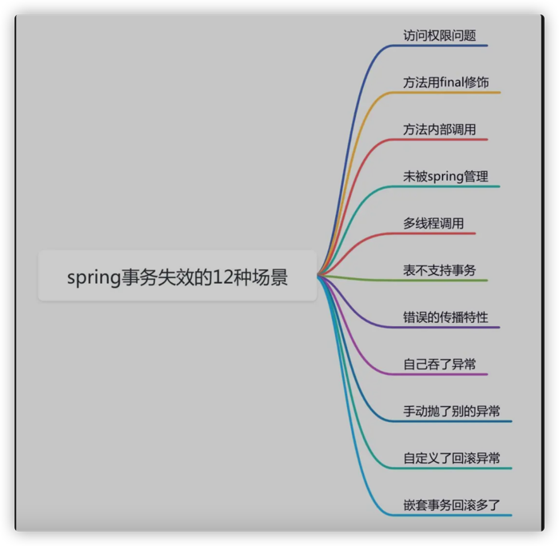

# @Transactional注解参数详解
```text

参数一: propagation

详情如下:

 REQUIRED：支持当前事务，如果当前没有事务，就新建一个事务。这是最常见的选择。 
 SUPPORTS：支持当前事务，如果当前没有事务，就以非事务方式执行。 
 MANDATORY：支持当前事务，如果当前没有事务，就抛出异常。 
 REQUIRES_NEW：新建事务，如果当前存在事务，把当前事务挂起。 
 NOT_SUPPORTED：以非事务方式执行操作，如果当前存在事务，就把当前事务挂起。 
 NEVER：以非事务方式执行，如果当前存在事务，则抛出异常。 
 NESTED：支持当前事务，如果当前事务存在，则执行一个嵌套事务，如果当前没有事务，就新建一个事务。 

 

参数二:事物超时设置: timeout

默认30秒

 

参数三:事务隔离级别:isolation

详情如下:

Isolation.READ_UNCOMMITTED  : 读取未提交数据(会出现脏读, 不可重复读) 基本不使用

Isolation.READ_COMMITTED  : 读取已提交数据(会出现不可重复读和幻读)

Isolation.REPEATABLE_READ：可重复读(会出现幻读)
Isolation.SERIALIZABLE：串行化

备注:

MYSQL: 默认为REPEATABLE_READ级别
SQLSERVER: 默认为READ_COMMITTED

 

参数四: readOnly 

属性用于设置当前事务是否为只读事务，设置为true表示只读，false则表示可读写，默认值为false。

 

参数五:rollbackFor

该属性用于设置需要进行回滚的异常类数组，当方法中抛出指定异常数组中的异常时，则进行事务回滚。例如：

指定单一异常类：@Transactional(rollbackFor=RuntimeException.class)

指定多个异常类：@Transactional(rollbackFor={RuntimeException.class, Exception.class})

 

参数六: rollbackForClassName

该属性用于设置需要进行回滚的异常类名称数组，当方法中抛出指定异常名称数组中的异常时，则进行事务回滚。例如：

指定单一异常类名称：@Transactional(rollbackForClassName="RuntimeException")

指定多个异常类名称：@Transactional(rollbackForClassName={"RuntimeException","Exception"})

 

参数七:noRollbackForClassName

该属性用于设置不需要进行回滚的异常类名称数组，当方法中抛出指定异常名称数组中的异常时，不进行事务回滚。例如：

指定单一异常类名称：@Transactional(noRollbackForClassName="RuntimeException")

指定多个异常类名称：

@Transactional(noRollbackForClassName={"RuntimeException","Exception"})

 

 

参数八:noRollbackFor

该属性用于设置不需要进行回滚的异常类数组，当方法中抛出指定异常数组中的异常时，不进行事务回滚。例如：

指定单一异常类：@Transactional(noRollbackFor=RuntimeException.class)

指定多个异常类：@Transactional(noRollbackFor={RuntimeException.class, Exception.class})
```
# spring事务失效的12种场景

```text
https://mp.weixin.qq.com/s/Vxp2YgWvaUBnmNs2YFE6tA

spring的@Transactional注解可以很方便的开启事务，
但是默认只在遇到运行时异常和Error时才会回滚，非运行时异常不回滚，
即Exception的子类中，除了RuntimeException及其子类，其他的类默认不回滚

```
