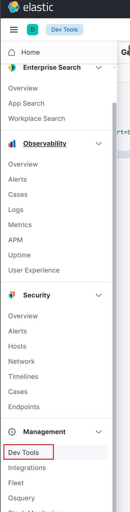

# 一.CRUD

```text
就是发http各种请求完成与es交互
6,7,8api有变化
```

## 1.新增

/库名/表名/id

```text
put http://hadoop103:9200/test1/user/3
```

## 2.更新

```text
post http://hadoop103:9200/test1/user/1
```

## 3.查询

```text
get http://hadoop103:9200/test1/user/1
```

7.17.15版本不一样 ,多了一层doc

```json
{
  "_source" : {
    "doc" : {
      "name" : "法外狂徒张三",
      "age" : 10,
      "birthday" : "2000-01-01"
    }
  }
}
```

```text
类型（Type）移除：从Elasticsearch 7.x开始，索引下的类型（如user或BookEntity）被移除了。
这意味着每个索引只能有一个默认类型 _doc。如果你使用的是Elasticsearch 7.x或更高版本，那么在URL中指定类型会导致错误
```

# 二.kibana



第一个参数 库名,
sort= 排序关键字

```text
GET test1/_search?q=*&sort=birthday:asc
```

DSL语法
query 查询字段
match_all 返回所有
sort 排序, "order": "desc" 固定是,前面的是字段名

```text
GET test1/_search
{
    "query": {
        "match_all": {}
    },
   "sort": [
      {
       "birthday": {
         "order": "desc"
       }
     }
   ]
}
```

match 多了一层  "doc"

```text
GET test1/_search
{
    "query": {
       "match": {
         "doc.age": 10
       }
    },
   "sort": [
      {
       "age": {
         "order": "desc"
       }
     }
   ]
  
}
```

模糊查询
"_score" : 0.7549127, 命中得分

```text
GET test1/_search
{
    "query": {
       "match": {
        "doc.name": "张"
       }
    }
}
```
